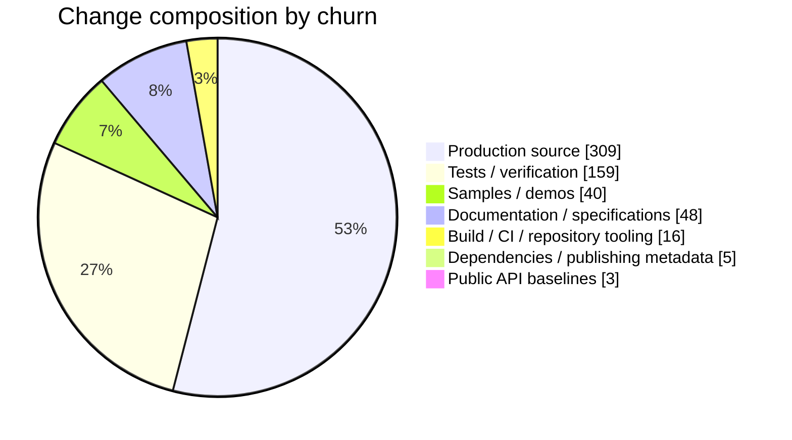

# Diff Breakdown

Diff Breakdown is a GitHub Action that explains what changed in a pull request. It posts one sticky comment covering production code, tests, modules, platforms, API baselines, and configured dependency reach.

It works without a checkout or build execution. Kotlin, Java, and Swift layouts receive first-class classification; other repositories get useful generic source, test, docs, sample, tooling, and dependency categories.

## Add it to a repository

Create `.github/workflows/diff-breakdown.yml`:

```yaml
name: Diff Breakdown

on:
  pull_request_target:
    types: [opened, synchronize, reopened, ready_for_review]

permissions:
  contents: read
  pull-requests: write

jobs:
  breakdown:
    runs-on: ubuntu-latest
    steps:
      - uses: szijpeter/diff-breakdown@bc613f9011374a65acc55202084142bce3e3cf6a # v0.1.0
        with:
          token: ${{ github.token }}
```

No checkout is needed. The example is pinned to the full v0.1.0 commit SHA for a reviewable supply chain.

## What reviewers see

The comment keeps the high-signal overview open and the supporting views collapsible:

- 📊 exact category totals with compact change-share bars and an optional Mermaid composition chart;
- module-by-change-kind intensity matrix;
- Kotlin Multiplatform, JVM, Android, Apple, Web, Native, and Swift distribution;
- added, modified, removed, renamed, and copied file counts;
- textual `.api` and `.klib.api` declaration changes when GitHub supplies patches;
- direct and transitive dependents from an optional configured graph;
- explicit warnings for incomplete GitHub metadata or unclassified source files.

Change volume is review context, not a risk, quality, or test-coverage score.

## Example report

The following report was generated by Diff Breakdown for a fictional 11-file cross-platform passkey change (`+519/-61`). The repository, commit identifiers, and file changes are illustrative; the classifications, totals, percentages, and rendered views are the action's real output for that metadata.

<!-- diff-breakdown:v1 -->

## 📊 Cross-platform passkey change map

<sub>base <code>main</code> · head <code>4f83ab91c2d7</code></sub>

**11 files** · 🟢 **+519 added** · 🔴 **−61 deleted** · **4 modules** · **4 platforms** · **3 potential dependents**

| Category | Files | 🟢 Added | 🔴 Deleted | 📊 Change share |
|---|---:|---:|---:|---|
| 📦 Production source | 4 | **+269** | **−40** | `█████▍░░░░` 53.3% |
| 🧪 Tests / verification | 2 | **+154** | **−5** | `██▊░░░░░░░` 27.4% |
| 🧭 Samples / demos | 1 | **+34** | **−6** | `▊░░░░░░░░░` 6.9% |
| 📚 Documentation / specifications | 1 | **+45** | **−3** | `▉░░░░░░░░░` 8.3% |
| 🔧 Build / CI / repository tooling | 1 | **+12** | **−4** | `▎░░░░░░░░░` 2.8% |
| 📦 Dependencies / publishing metadata | 1 | **+3** | **−2** | `▏░░░░░░░░░` 0.9% |
| 📐 Public API baselines | 1 | **+2** | **−1** | `▏░░░░░░░░░` 0.5% |

<details>
<summary>Change form — 2 added, 9 modified</summary>

| Status | Files |
|---|---:|
| Added | 2 |
| Modified | 9 |

Additions and removals are shown separately above; churn is descriptive and is not a coverage or risk score.

</details>

<details open>
<summary>Module change matrix — 4 changed modules</summary>

| Module | Production source | Tests / verification | Public API baselines | Total |
|---|---:|---:|---:|---:|
| <code>core</code> | █ 104 | █ 101 | · | **205** |
| <code>android</code> | ▓ 71 | ▓ 58 | · | **129** |
| <code>WalletUI</code> | ▓ 71 | · | · | **71** |
| <code>apple</code> | ▓ 63 | · | █ 3 | **66** |

Intensity is relative within each column: `░` low, `▒` medium, `▓` high, `█` highest.

</details>

<details>
<summary>Platform distribution — 4 platforms</summary>

| Platform | Files | Production | Tests | Other | 📊 Change share |
|---|---:|---:|---:|---:|---|
| Common | 2 | 104 | 101 | 0 | `████▍░░░░░` 43.8% |
| Android | 2 | 71 | 58 | 0 | `██▊░░░░░░░` 27.6% |
| Swift | 1 | 71 | 0 | 0 | `█▌░░░░░░░░` 15.2% |
| Apple | 1 | 63 | 0 | 0 | `█▍░░░░░░░░` 13.5% |

</details>

<details>
<summary>Public API baseline — 2 visible additions, 1 visible removal</summary>

- Baseline files: **1**
- Text additions / removals: **+2 / -1**
- Visible declaration-like additions / removals: **2 / 1**

**Added declarations**

- <code>public final fun createPasskey(): kotlin.Unit</code> — <code>apple/api/apple.klib.api</code>
- <code>public final val isAvailable: kotlin.Boolean</code> — <code>apple/api/apple.klib.api</code>

**Removed declarations**

- <code>public final fun legacyCreate(): kotlin.Unit</code> — <code>apple/api/apple.klib.api</code>

> Declaration extraction is a textual baseline view, not a language compatibility verdict.

</details>

<details>
<summary>Dependency reach — 3 potential dependents</summary>

- Changed graph modules: <code>android</code>, <code>apple</code>, <code>core</code>, <code>WalletUI</code>
- Potentially impacted dependents: <code>android-app</code>, <code>ios-app</code>, <code>wallet-app</code>

> Impact follows configured module edges. It identifies structural reach, not runtime behavior.

</details>

<details>
<summary>Visualizations — change composition</summary>



</details>

<details>
<summary>Method and provenance</summary>

- Active presets: <code>generic</code>, <code>kotlin-gradle</code>, <code>swift-package</code>
- Configuration: <code>.github/diff-breakdown.yml</code> at <code>8ac4f12b7e90</code> · <code>sha256:9d7f586b98ff</code>
- Every changed file returned by GitHub is represented exactly once in the category totals.
- Category, module, and platform facts retain configured or inferred provenance during analysis.
- Change volume is descriptive; it is not test coverage, code quality, or risk.

</details>

## Configuration

Zero configuration auto-detects relevant layouts. For a monorepo, add `.github/diff-breakdown.yml` on the base branch:

```yaml
$schema: https://raw.githubusercontent.com/szijpeter/diff-breakdown/main/diff-breakdown.schema.json
version: 1
title: Mobile change map
presets: [kotlin-gradle, java-gradle, swift-package]

modules:
  roots:
    - "core/*"
    - "client/*"
    - pattern: "ios/features/*"
      name: "apple-$1"

categories:
  - id: contracts
    label: Cross-language contracts
    icon: "🔗"
    priority: 100
    include: ["contracts/**", "**/interop/**"]

platforms:
  - id: swift-bridge
    label: Swift bridge
    include: ["ios/**/Sources/**/*.swift"]

dependencyGraph:
  edges:
    - { from: "client/mobile", to: "core/model" }
    - { from: "ios/passkeys", to: "core/model" }

views: [composition, status, modules, platforms, api, dependencies]
```

An edge `{ from: app, to: core }` means `app` depends on `core`. The schema rejects unknown keys, unsafe markers, and malformed selectors.

The Action always loads configuration from the pull request's base commit. A fork pull request cannot change the privileged workflow's behavior.

## Inputs and outputs

| Input | Default | Purpose |
|---|---|---|
| `token` | required | Reads PR metadata and maintains the comment |
| `pr-number` | event PR | Supports manual or composed workflows |
| `config-path` | `.github/diff-breakdown.yml` | Trusted YAML or JSON configuration |
| `comment` | `true` | Creates or updates the sticky comment |
| `summary` | `true` | Writes the same breakdown to the job summary |

Outputs are `total-files`, `total-churn`, and `warning-count`.

## Security and limits

The Action never checks out or executes pull-request code. It treats paths, patches, branch names, and extracted declarations as untrusted display data. See [SECURITY.md](SECURITY.md) for the full trust boundary.

GitHub's pull-request files API returns at most 3,000 files. Larger pull requests are clearly marked incomplete. Patch text can also be absent for binary or very large files; declaration details are then marked partial while file-level totals remain available.

## Development

```bash
npm ci
npm run check
```

The committed Node 24 bundle is rebuilt by the check and verified in CI. Real pull-request replay evidence is recorded in [docs/validation.md](docs/validation.md).

Apache-2.0 licensed.
